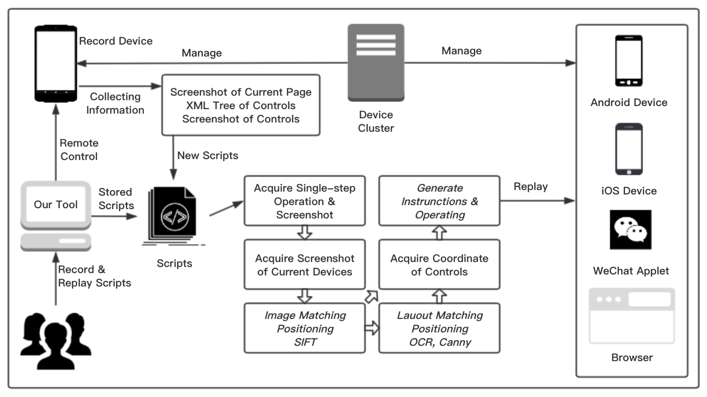

# RAT

## The vedio of the tool can be seen at:

## RAT: Image and Layout Recognition Driving Automated Testing of Cross-Platform

The fragmentation problem of mobile platforms hinders test scripts from running across platforms. To reduce the cost of adapting these scripts for various platforms, some existing tools apply conventional computer vision techniques to replay the same script on multiple platforms automatically. However, because these solutions can hardly identify dynamic elements, it becomes difficult for engineers to apply them in practice. 
In this paper, we present an image-driven method, namely RAT, to record and replay test scripts cross platforms. RAT records screenshots and layouts of the widgets, and combines image recognition techniques and layout positioning techniques to locate them. Based on accurate localization, RAT supports replaying test scripts across devices and platforms. To validate our tool, we experimented RAT on 25 scripts from five applications. We employ RAT to replay these scripts across 8 Android devices and 2 iOS devices. The results show that RAT can replay 95% scripts on Android platforms and 60% on iOS platforms.

